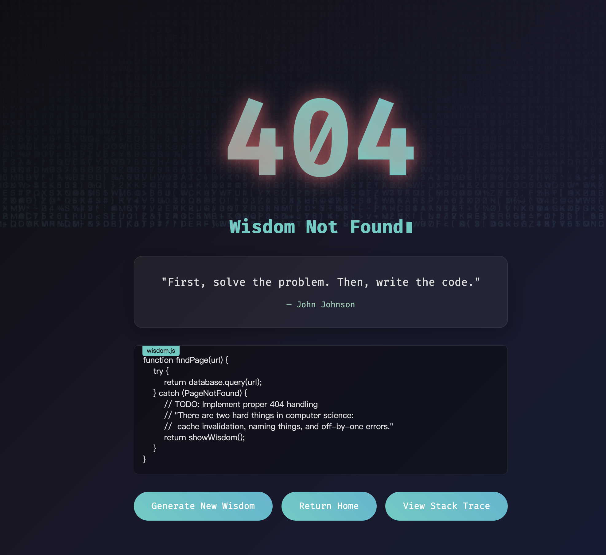
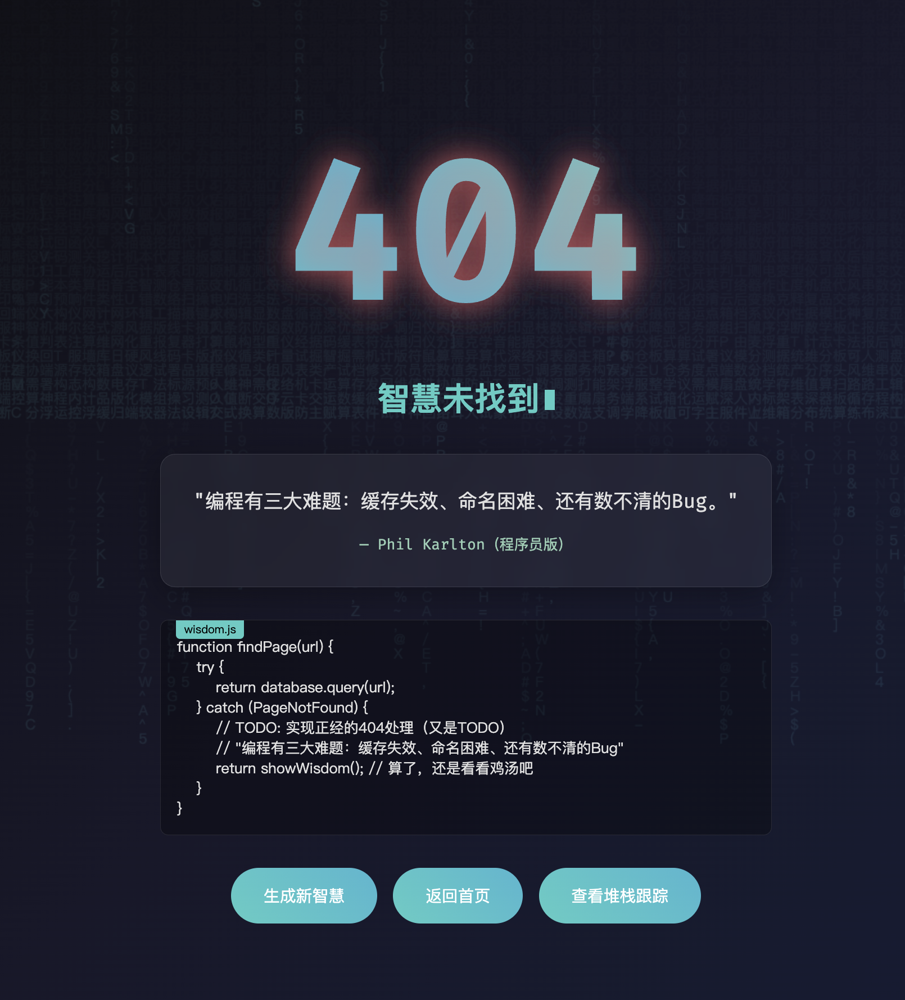

# 🚀 Programming Wisdom 404

一个富有创意的404错误页面，将枯燥的错误信息转化为程序员智慧语录的展示平台。

[English](#english-version) | [中文](#中文版本)

## ✨ 特性

### 🌏 双语支持

- **自动语言检测**：根据浏览器语言设置自动切换中英文
- **语言记忆**：保存用户语言偏好
- **完整本土化**：不仅是翻译，更是文化适配

### 🎨 视觉效果

- **Matrix雨背景**：动态字符下落效果，中英文字符集切换
- **故障风格404**：带有RGB偏移的故障艺术效果
- **浮动动画**：编程符号/中文词汇的浮动效果
- **毛玻璃设计**：现代化的UI设计风格

### 📝 程序员文化

- **智慧语录库**：收录经典编程名言和中文程序员梗
- **代码示例**：带有双语注释的示例代码
- **堆栈跟踪**：幽默化的错误信息展示
- **程序员梗**：融入中国程序员文化的本土化内容

## 🎯 在线演示

[Live Demo](https://xiebaiyuan.github.io/404/) - 在线体验完整功能

## 📸 截图

### 英文版本



### 中文版本



## 🛠️ 技术栈

- **HTML5** - 语义化结构
- **CSS3** - 动画效果和响应式设计
- **JavaScript** - 交互逻辑和动态效果
- **Canvas API** - Matrix雨效果
- **Local Storage** - 语言偏好保存

## 🚀 快速开始

### 1. 克隆项目

```bash
git clone https://github.com/xiebaiyuan/404.git
cd 404
```

### 2. 本地运行

```bash
# 使用任意HTTP服务器
python -m http.server 8000
# 或者
npx serve .
# 或者
live-server
```

### 3. 访问页面

打开浏览器访问 `http://localhost:8000`

## 📂 项目结构

```text
404/
├── programming_wisdom_404.html    # 主页面文件
├── README.md                      # 项目文档
├── screenshots/                   # 截图目录
│   ├── en-version.png
│   └── zh-version.png
└── LICENSE                        # 开源协议
```

## 🎨 自定义配置

### 修改智慧语录

在 `wisdomQuotes` 对象中添加新的语录：

```javascript
const wisdomQuotes = {
    en: [
        {
            quote: "Your new wisdom quote",
            author: "Author Name"
        }
    ],
    zh: [
        {
            quote: "你的新智慧语录",
            author: "作者姓名"
        }
    ]
};
```

### 自定义Matrix字符

修改 `charSets` 对象中的字符集：

```javascript
const charSets = {
    en: 'YOUR_CUSTOM_CHARACTERS',
    zh: '你的自定义字符集'
};
```

### 修改跳转链接

更改 `goHome()` 函数中的URL：

```javascript
function goHome() {
    window.location.href = 'https://your-website.com';
}
```

## 🌟 功能详解

### 智慧语录系统

- 10+条经典英文编程语录
- 12+条本土化中文程序员语录
- 随机切换动画效果
- 淡入淡出过渡动画

### 视觉特效系统

- **Matrix雨效果**：Canvas实现的字符下落动画
- **故障艺术**：CSS动画实现的RGB偏移效果
- **浮动元素**：随机生成的编程符号动画
- **响应式设计**：适配不同屏幕尺寸

### 语言切换系统

- 浏览器语言自动检测
- 一键切换中英文界面
- 语言偏好本地存储
- 实时更新所有文本内容

## 🎭 程序员文化元素

### 经典编程梗

- **"三件困难的事"**：经典的off-by-one error笑话
- **TODO注释**：程序员永远的痛
- **重启大法**：运维万能解决方案

### 中文本土化内容

- **"能跑就行"**：佛系程序员哲学
- **"deadline是万能之母"**：项目管理真理
- **堆栈跟踪中文化**：程序员日常写照

## 🤝 贡献指南

欢迎提交Issue和Pull Request！

### 贡献类型

- 🐛 Bug修复
- ✨ 新功能
- 📝 文档改进
- 🎨 UI/UX优化
- 🌐 翻译改进

### 提交规范

1. Fork本项目
2. 创建功能分支 (`git checkout -b feature/AmazingFeature`)
3. 提交更改 (`git commit -m 'Add some AmazingFeature'`)
4. 推送到分支 (`git push origin feature/AmazingFeature`)
5. 创建Pull Request

## 📄 开源协议

本项目基于 MIT 协议开源 - 查看 [LICENSE](LICENSE) 文件了解详情

## 👨‍💻 作者

**xiebaiyuan**

- GitHub: [@xiebaiyuan](https://github.com/xiebaiyuan)
- Website: [xiebaiyuan.top](https://www.xiebaiyuan.top)

## 🙏 致谢

- 感谢所有贡献智慧语录的程序员们
- 感谢开源社区的支持和反馈
- 特别感谢Matrix电影为视觉效果提供的灵感

## 📈 统计


---

## English Version

A creative 404 error page that transforms boring error messages into a showcase of programming wisdom quotes.

### Features

- **Bilingual Support**: Auto-detects browser language and switches between English and Chinese
- **Visual Effects**: Matrix rain background with glitch-style 404 text
- **Programming Culture**: Curated collection of programming wisdom and developer memes
- **Interactive Elements**: Animated floating icons and smooth transitions
- **Responsive Design**: Works seamlessly across all device sizes

### Tech Stack

- Pure HTML5/CSS3/JavaScript
- Canvas API for Matrix rain effect
- LocalStorage for language preferences
- No external dependencies

### Quick Start

1. Clone the repository
2. Open `programming_wisdom_404.html` in your browser
3. Enjoy the programming wisdom!

### Customization

Easily customize quotes, character sets, and styling by modifying the JavaScript configuration objects.

---

<div align="center">
  <p>如果这个项目对你有帮助，请给它一个⭐️</p>
  <p>If this project helps you, please give it a ⭐️</p>
</div>
